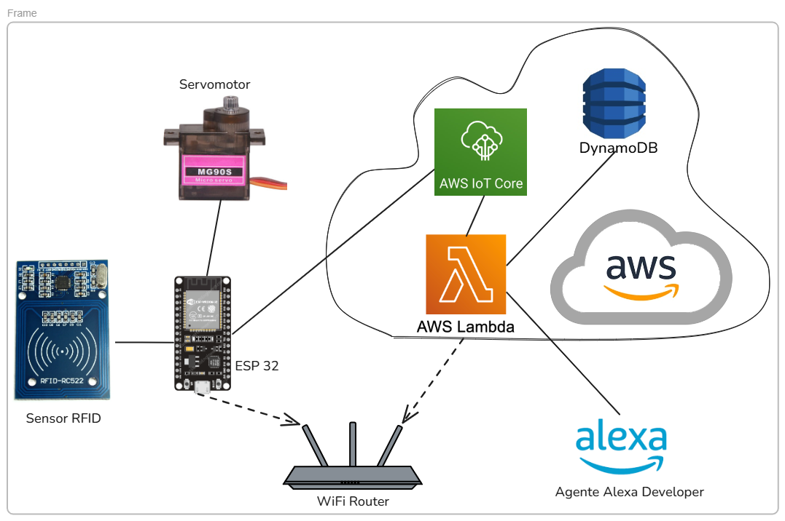
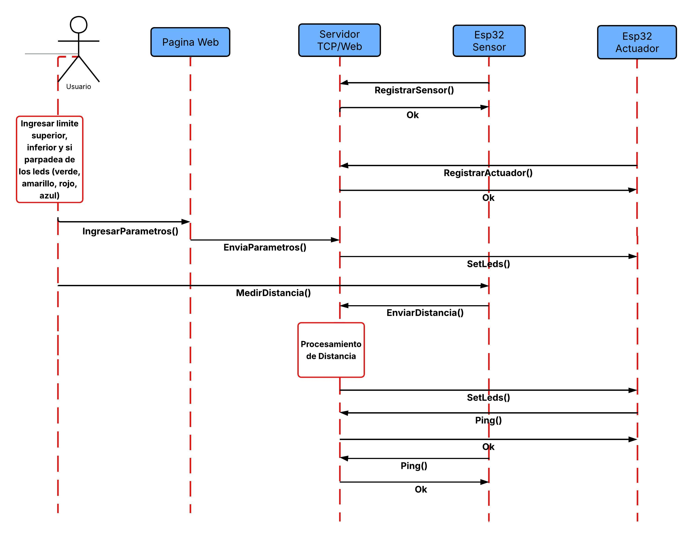
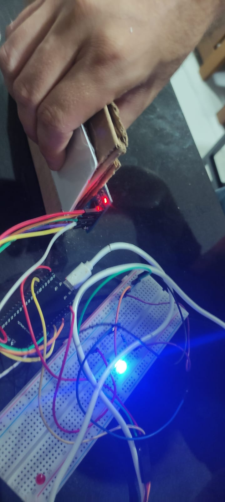

# Universidad Católica Boliviana Cochabamba
## Departamento de Ingeniería y Ciencias Exactas
## [SIS-234] Internet De Las Cosas
### Carrera de Ingeniería de Sistemas

---

# Informe sobre:
## Integración de un objeto inteligente con Alexa mediante MQTT y AWS.

### Evaluación de la Materia Internet de las Cosas

**Autores:**

- Vargas Prado Ariana Nicole  
- Zubieta Sempertegui Andres Ignacio  

---

Cochabamba - Bolivia  
Mayo 2026 

# 1. Requerimientos Funcionales y No Funcionales
## Requerimientos Funcionales

- El sistema debe permitir la lectura de tarjetas mediante un sensor RFID-RC522.

- El sistema debe identificar y diferenciar cada tarjeta RFID registrada.
- El sistema debe enviar el ID de la tarjeta leída hacia AWS IoT Core mediante MQTT.
- El sistema debe actualizar el estado reportado del dispositivo en el Shadow de AWS IoT Core.
- El sistema debe recibir comandos desde AWS IoT Core a través del Device Shadow desde Alexa y IoT core, los comandos se dividen en: 
    #### Comandos de acción del sistema:
   - Abrir puerta (SetModeOpen)
   - Cerrar puerta (SetModeClose)
   - Automatizar la puerta (SedModeAuto)
   - Cambiar temporizador de puerta (SetAutoTimer)
   - Registrar un RFID autorizado (SetCurrentTag)
   - Quitar un RFID registrado (RemoveCurrentTag)
    #### Comandos para recibir informacióm del sistema: 
   - Obtener estado del motor (GetMotorState) 
   - Obtener nombre del tag si esta presente (GetIfPresentTag) 
   - Obtener el tiempo de la ultima vez que se abrió la puerta (GetLastOpenTime) 
   - Obtener el ultimo tag registrado (GetLastTag) 
   - Obtener el estado de la puerta (GetDoorState)

- El sistema debe controlar el servomotor MG90S en función de los comandos anteriormente mencionados. 
- El sistema debe permitir el movimiento del servomotor cuando una tarjeta autorizada sea detectada.
- El sistema debe negar el acceso cuando una tarjeta no autorizada sea detectada.
El sistema debe permitir el control del servomotor mediante comandos a través de Alexa.
El sistema debe permitir que Alexa registre y mande las siguientes categorías:
   - Estado de la puerta: si está abierta o cerrada
   - Estado del motor: si está en movimiento o si está parado 
   - Información del sensor: si percibió algo, en qué momento percibió la mascota, que mascota percibió
   - nombre de la mascota

## Requerimientos No Funcionales

- El sistema debe garantizar una comunicación segura con AWS IoT Core (uso de certificados y TLS).
- El sistema debe tener una latencia de respuesta menor a 5 segundos entre comando y acción.
- El sistema debe ser escalable para integrar más sensores o actuadores en el futuro.
- El sistema debe ser modular, permitiendo separar lógica de hardware, red y control.
- El sistema debe manejar errores de conexión (reintentos automáticos a AWS).
- El sistema debe ser compatible con redes WiFi estándar (802.11 b/g/n).
- El sistema debe registrar logs básicos para depuración y monitoreo.
- El sistema debe ser fácil de usar mediante comandos simples en Alexa.

# 2. Diseño del Sistema

## 2.1 Diagrama de circuito

## 2.2 Diagrama de arquitectura del sistema

## 2.3 Diagramas estructurales y de comportamiento
### 2.3.1 Diagrama de secuencia

### 2.3.2 Diagramas uml de clases

# 3. Implementación

## 3.1 Código fuente documentado

[Enlace a GitHub] https://github.com/Andrezubi/IoT-4to-Entregable

# 4. Pruebas y Validaciones
## Prueba de exactitud de distancia

Para evaluar la exactitud del sistema se realizaron 20 mediciones a tres distancias de referencia: 80 cm, 50 cm y 20 cm utilizando el sensor ultrasónico. Con los datos obtenidos se calcularon el promedio, la desviación estándar y el porcentaje de error de precision y exactitud, con el objetivo de comparar las mediciones del sistema con las distancias reales.

Los datos utilizados en esta prueba se encuentran en la hoja:

[Exactitud de distancia](https://docs.google.com/spreadsheets/d/1DyKpLJWUTkjiDA7z87IJXlJ0ULdZPX75TzI_sI9DBeM/edit?gid=0#gid=0)

## Prueba de materiales para distancia

Para analizar el comportamiento del sensor ultrasónico frente a distintos materiales, se realizaron 10 mediciones a una distancia de referencia de 30 cm utilizando superficies como madera, plástico, vidrio, mano, plastoformo, metal y cerámica, además de una medición de control sin objeto. El objetivo fue observar cómo el tipo de material influye en la medición de distancia del sensor.

Con los datos obtenidos se calcularon el promedio, la desviación estándar y los errores de exactitud y precisión para cada material. 

Los datos utilizados en esta prueba se encuentran en la hoja:

[prueba de materiales para distancia](https://docs.google.com/spreadsheets/d/1DyKpLJWUTkjiDA7z87IJXlJ0ULdZPX75TzI_sI9DBeM/edit?gid=282925511#gid=282925511)

## Prueba de distancias mínimas y máximas del sensor

Para evaluar el rango de funcionamiento del sensor ultrasónico se realizaron mediciones en distancias cercanas al límite máximo y mínimo de detección. En el caso de las distancias máximas se tomaron mediciones entre 270 cm y 310 cm, mientras que para las distancias mínimas se realizaron pruebas entre 10 cm y 0 cm, registrando varias mediciones para cada punto.

Los datos utilizados en esta prueba se encuentran en la hoja:

[prueba de distancias minimas y maximas sensor](https://docs.google.com/spreadsheets/d/1DyKpLJWUTkjiDA7z87IJXlJ0ULdZPX75TzI_sI9DBeM/edit?gid=2038861534#gid=2038861534)
 
## Prueba parpadeo por segundo

Se realizaron pruebas para verificar la frecuencia de parpadeo de un LED configurado a diferentes valores entre 1 y 5 parpadeos por segundo (b/s). Para cada configuración se contó manualmente el número de parpadeos durante 10 segundos. El procedimiento se repitió 6 veces por cada frecuencia con el fin de obtener resultados más confiables y calcular un promedio de los valores registrados.

[Prueba parpadeo por segundo](https://docs.google.com/spreadsheets/d/1DyKpLJWUTkjiDA7z87IJXlJ0ULdZPX75TzI_sI9DBeM/edit?gid=241907707#gid=241907707)

# 5. Resultados

## 5.1 Resultados de integración del sistema distribuido

El sistema implementado, compuesto por dos módulos ESP32 (sensor y actuador), un servidor TCP central y una interfaz web, logró establecer comunicación efectiva mediante WiFi (IEEE 802.11).

El ESP32 sensor realizó la adquisición continua de datos provenientes del sensor ultrasónico y los transmitió correctamente al servidor. A su vez, el servidor procesó la información recibida, aplicó la lógica de control definida por los rangos de distancia y generó comandos que fueron enviados al ESP32 actuador.

El ESP32 actuador respondió adecuadamente ejecutando las acciones correspondientes sobre los LEDs (encendido y parpadeo según el rango de distancia). Esto demuestra que la arquitectura cliente–servidor–actuador funciona de manera coherente y sincronizada.

## 5.2 Resultados de clasificación por rangos

El sistema logró clasificar correctamente las distancias en los rangos definidos:

- Menor a 20 cm → LED verde constante  
- Entre 20 cm y 50 cm → LED amarillo en parpadeo lento  
- Entre 50 cm y 80 cm → LED rojo en parpadeo  
- Mayor a 80 cm → LED azul en parpadeo  
- Sin detección → LEDs apagados  

Se verificó que el servidor interpreta correctamente los datos recibidos y envía comandos adecuados al actuador, cumpliendo con la lógica de control definida.

## 5.3 Resultados de comunicación TCP y web

La comunicación TCP entre los componentes del sistema se mantuvo estable durante las pruebas. No se evidenciaron pérdidas significativas de datos en condiciones normales de operación.

La página web permitió visualizar y modificar parámetros del sistema, los cuales fueron recibidos por el servidor y reflejados en el comportamiento del sistema, validando la correcta integración de la interfaz de usuario con la lógica del servidor.

## 5.4 Resultados de tolerancia a fallos y reconexión

Durante las pruebas de desconexión de los módulos ESP32, el sistema mostró capacidad de recuperación mediante reconexión a la red WiFi y al servidor.

El servidor fue capaz de manejar la desconexión del cliente sensor o actuador sin afectar el funcionamiento general del sistema, evidenciando tolerancia a fallos en la red y continuidad operativa.

## 5.5 Resultados de pruebas de exactitud de distancia

Los resultados obtenidos previamente muestran que el sistema mantiene un alto nivel de precisión en la medición de distancia:

- 80 cm → 79.63 cm (error: 0.46%)  
- 50 cm → 49.52 cm (error: 0.96%)  
- 20 cm → 20.04 cm (error: 0.21%)  

Esto cumple con el requerimiento no funcional de mantener un error menor al 2.5%, validando el correcto procesamiento de la señal del sensor ultrasónico en el ESP32 sensor.

## 5.6 Resultados de rendimiento del sistema

El sistema mostró tiempos de respuesta menores a 1 segundo desde la medición hasta la activación del actuador, cumpliendo con el requisito de operación en tiempo casi real.

Asimismo, el sistema mantiene una operación continua mientras ambos ESP32 estén conectados al servidor y a la red WiFi, cumpliendo con los requerimientos de disponibilidad y conectividad.

# 6. Conclusiones

- El sistema distribuido basado en dos ESP32, un servidor TCP y una interfaz web fue implementado exitosamente, permitiendo la correcta adquisición, procesamiento y actuación sobre datos de distancia en tiempo real.

- La arquitectura cliente–servidor–actuador permitió desacoplar funciones, facilitando la escalabilidad del sistema y cumpliendo con principios de modularidad y distribución.

- El ESP32 sensor logró medir distancias con un alto grado de precisión, manteniendo errores menores al 2.5%, lo cual valida el uso del sensor ultrasónico dentro del rango operativo definido.

- El ESP32 actuador respondió correctamente a los comandos enviados por el servidor, ejecutando los patrones de encendido y parpadeo de LEDs según los rangos de distancia establecidos.

- El servidor TCP cumplió un rol central en la lógica del sistema, centralizando la comunicación, procesando datos y aplicando reglas de control de manera efectiva.

- La página web permitió la interacción del usuario con el sistema, habilitando la configuración de parámetros que influyen directamente en el comportamiento del sistema, cumpliendo su función como interfaz de control.

- El sistema demostró capacidad de tolerancia a fallos, permitiendo la reconexión de los módulos ESP32 sin afectar la estabilidad general.

- En general, los requerimientos funcionales y no funcionales definidos fueron cumplidos satisfactoriamente, destacando la estabilidad de la comunicación, la precisión de las mediciones y la correcta integración de todos los componentes.

# 7. Recomendaciones

- Se recomienda mejorar la gestión de la comunicación TCP implementando mecanismos de reconexión automática más robustos y detección de pérdida de conexión en tiempo real.

- Se sugiere optimizar el código de los ESP32 evitando bloqueos en la ejecución (por ejemplo, reemplazando funciones con retardos por temporizadores no bloqueantes) para mejorar la eficiencia del sistema.

- Para mejorar la escalabilidad, se recomienda diseñar el servidor de forma que pueda soportar múltiples clientes sensores y actuadores adicionales en el futuro.

- Se recomienda implementar protocolos de comunicación más estructurados (por ejemplo, con formatos tipo JSON) para facilitar la interpretación de mensajes entre cliente, servidor y actuador.

- Para mejorar la precisión en frecuencias de parpadeo, se recomienda el uso de temporizadores hardware en lugar de conteos manuales o delays, reduciendo el margen de error en frecuencias altas.

- Se sugiere automatizar las pruebas de validación (por ejemplo, conteo de parpadeos) para evitar errores humanos en la medición de resultados.

- Se recomienda mantener el sensor ultrasónico dentro de su rango óptimo de operación (aproximadamente 3 cm a 290 cm) y evitar superficies que absorban sonido, para asegurar mediciones más estables.

- Se sugiere fortalecer la interfaz web agregando validaciones de entrada y visualización en tiempo real del estado del sistema (conexión, datos del sensor, estado del actuador).

- Se recomienda considerar mecanismos de seguridad básicos en la comunicación TCP (validación de mensajes, control de acceso), especialmente si el sistema se despliega en redes no controladas.

# 8. Anexos 

[Enlace a la planilla de pruebas](https://docs.google.com/spreadsheets/d/1DyKpLJWUTkjiDA7z87IJXlJ0ULdZPX75TzI_sI9DBeM/edit?gid=0#gid=0) 

### Imagenes de las pruebas

